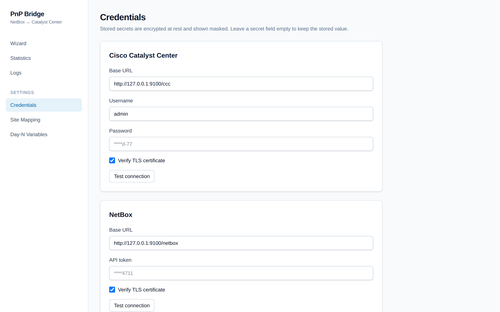
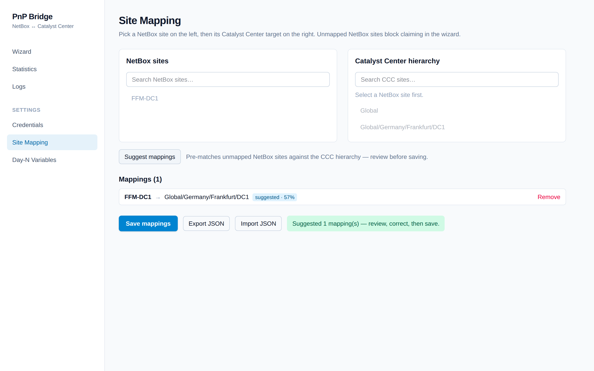
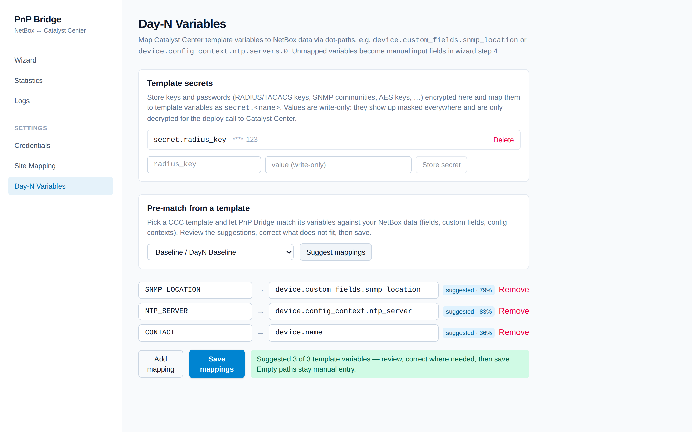
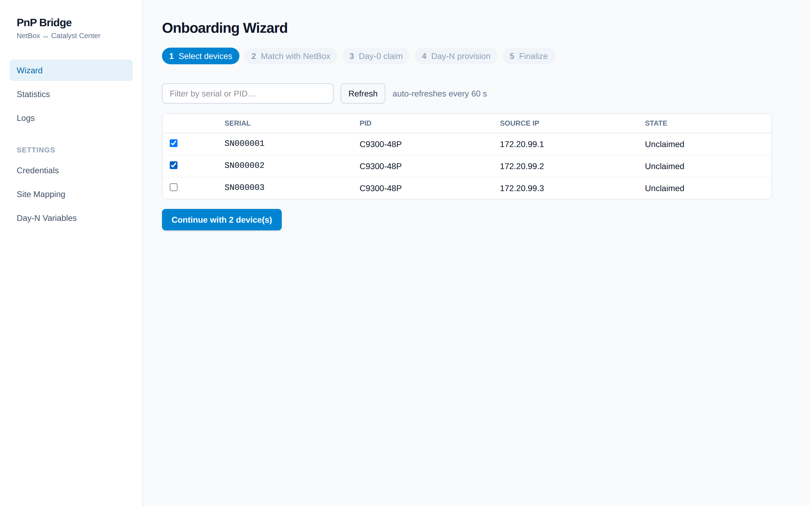
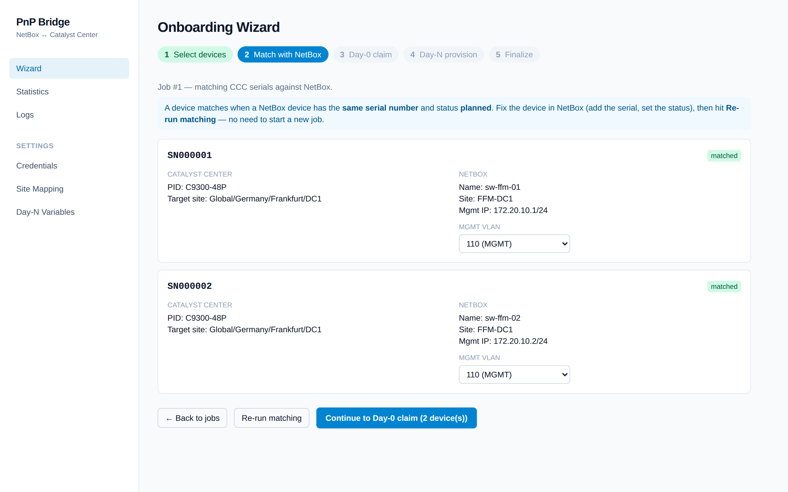
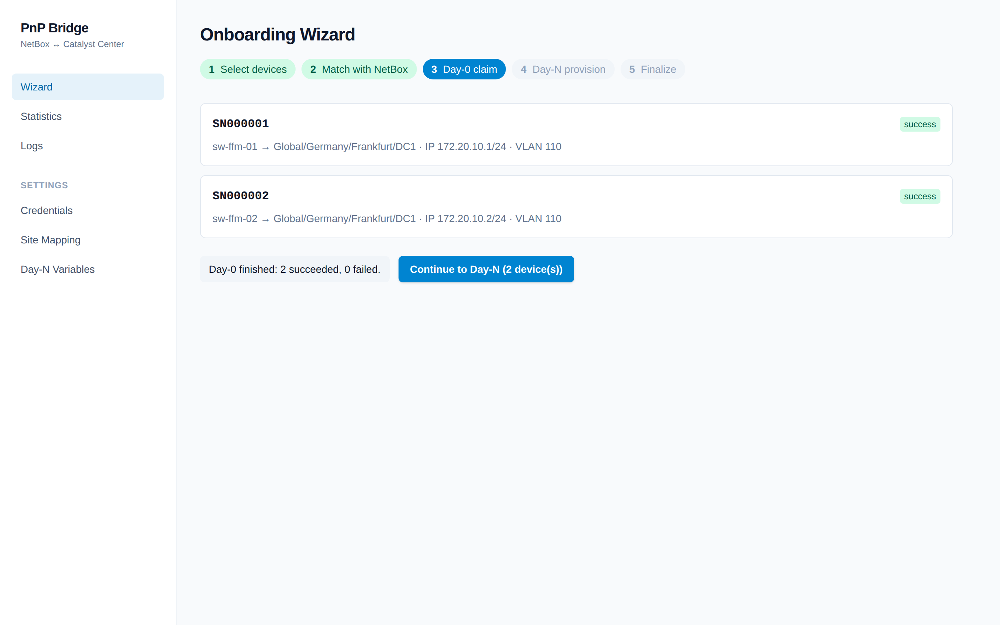
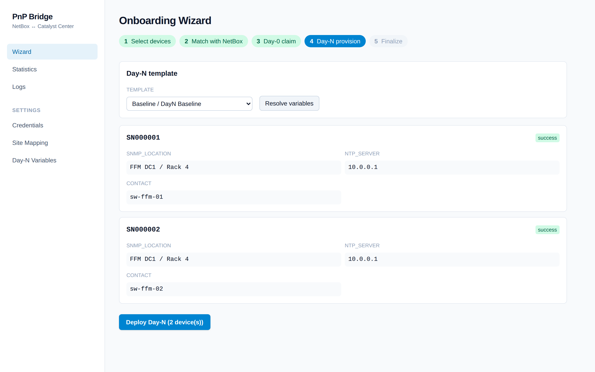
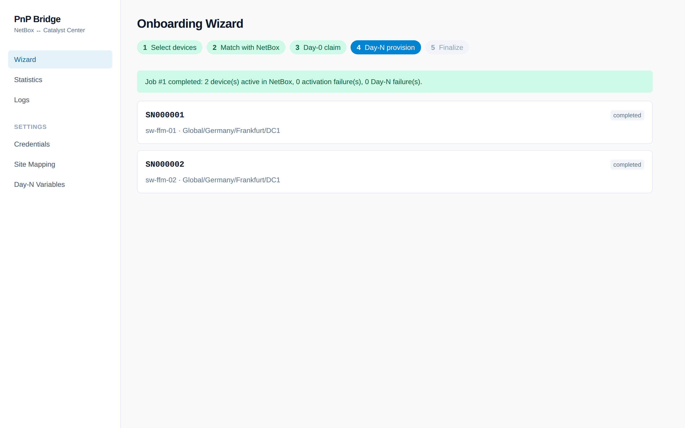
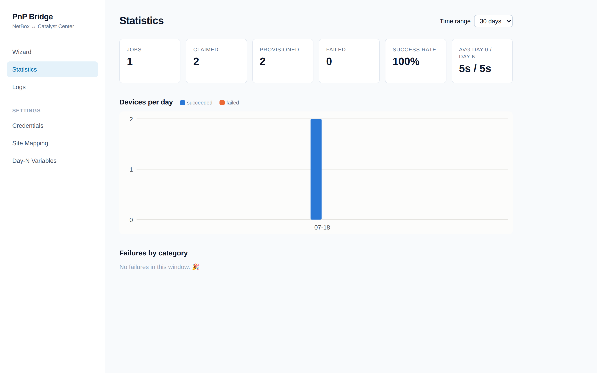
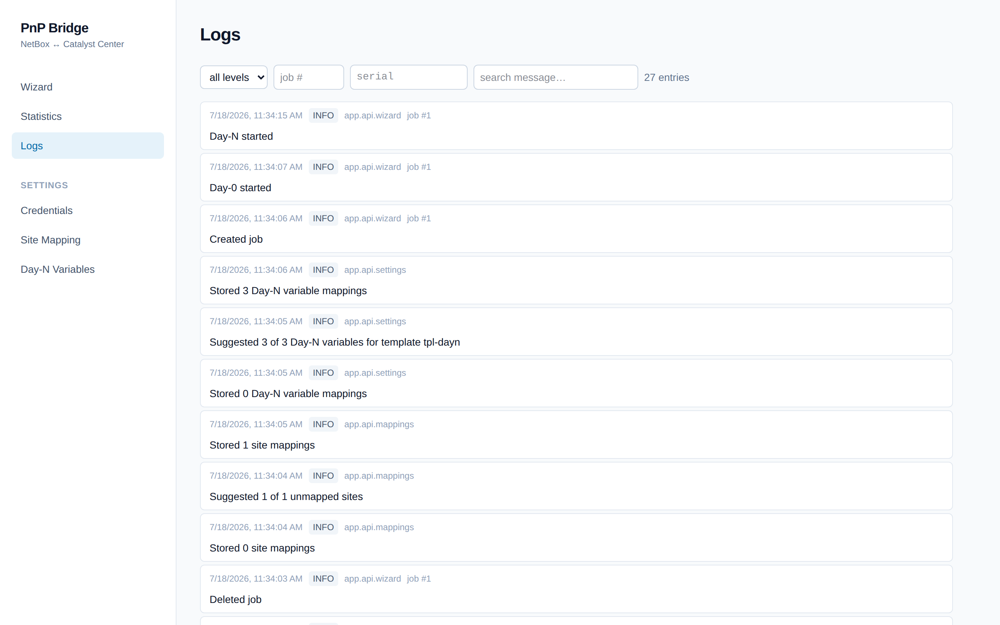

# PnP Bridge

A self-hosted deployment wizard that onboards network devices using **NetBox** as the
source of truth and **Cisco Catalyst Center** as the deployment engine: match unclaimed
PnP devices by serial, claim them to the right site (Day-0), provision Day-N templates
with NetBox-filled variables, notify Cisco ISE via webhook, and set the device `active`
in NetBox when done.

**How it fits together:**

```
 ┌─────────┐   devices (planned)    ┌────────────┐   claim / provision   ┌──────────────────┐
 │ NetBox  │ ─────────────────────▶ │ PnP Bridge │ ────────────────────▶ │ Catalyst Center  │
 │ (truth) │ ◀───────────────────── │   :8060    │ ◀──────────────────── │ (PnP, templates) │
 └─────────┘   PATCH status=active  └─────┬──────┘   task / PnP polling  └──────────────────┘
                                          │ signed webhook (day0_success)
                                          ▼
                                    ┌───────────┐
                                    │ ISE helper│
                                    └───────────┘
```

## Quick start

```bash
podman build -t pnp-bridge:dev -f Containerfile .   # or: make image
podman run --rm -p 8060:8060 -v pnpb-data:/data pnp-bridge:dev
```

Open **http://localhost:8060** — the container starts with **zero configuration**.
Database migrations run automatically; the encryption key is generated on first start
and stored as `secret.key` on the `/data` volume (or set `PNPB_SECRET_KEY` yourself):

```bash
python -c 'from cryptography.fernet import Fernet; print(Fernet.generate_key().decode())'
podman run --rm -p 8060:8060 -e PNPB_SECRET_KEY=<key> -v pnpb-data:/data pnp-bridge:dev
```

> **Back up `/data` as a unit** — it holds the SQLite DB *and* the key. One without the
> other means stored credentials cannot be decrypted. See `docs/runbook.md`.

| Env var | Default | Purpose |
|---|---|---|
| `PNPB_SECRET_KEY` | auto-generated | Fernet key for secrets at rest |
| `PNPB_DB_PATH` | `/data/pnpb.sqlite` | SQLite location |
| `PNPB_LOG_LEVEL` | `INFO` | stdout/DB log level |
| `PNPB_PORT` | `8060` | listen port |

## First-time setup

### 1. Credentials

**Settings → Credentials** — Catalyst Center (URL, user, password), NetBox (URL, API
token) and the optional ISE webhook (URL, HMAC secret). Every block has a **Test
connection** button. Secrets are write-only: after saving they only ever appear masked
(`****abcd`) — in the UI, the API, and the logs.



### 2. Site mapping

**Settings → Site Mapping** — pair each NetBox site with its Catalyst Center hierarchy
node. Click **Suggest mappings** and PnP Bridge pre-matches unmapped sites by fuzzy
name similarity (abbreviations included, e.g. `FFM-DC1 → Global/Germany/Frankfurt/DC1`).
Suggestions carry a confidence badge and are never saved without your review. Mappings
can be exported/imported as JSON.



### 3. Day-N variables & template secrets

**Settings → Day-N Variables** — map Catalyst Center template variables to NetBox data
using dot-paths:

| Template variable | Source path | Comes from |
|---|---|---|
| `HOSTNAME` | `device.name` | device field |
| `MGMT_IP` | `device.primary_ip4.address` | primary IP |
| `SNMP_LOCATION` | `device.custom_fields.snmp_location` | custom field |
| `NTP_SERVER` | `device.config_context.ntp_server` | config context |
| `RADIUS_KEY` | `secret.radius_key` | **template secret** |

Pick a template under **Pre-match from a template** and **Suggest mappings** fills the
table from your actual NetBox data (fields, custom fields, config contexts — sampled
from a real device) using a network-vocabulary synonym dictionary. Anything left
unmapped becomes a **manual input field** in wizard step 4.

**Template secrets** store keys and passwords (RADIUS/TACACS keys, SNMP communities,
AES keys, …) Fernet-encrypted. Reference them as `secret.<name>`. The plaintext is
decrypted only for the deploy call to Catalyst Center — the wizard, job history, logs,
and API responses never contain it.



## The onboarding wizard

One job = one batch of devices. All state lives server-side, so you can close the
browser at any step and **resume** later; jobs can also be deleted from the start page
(running jobs are protected until they finish).

### Step 1 — Select unclaimed devices

Live table of Catalyst Center PnP devices in state `Unclaimed` (serial, PID, source IP,
state) with search and 60 s auto-refresh. Tick the devices to onboard.



### Step 2 — Match with NetBox

Each selected serial is looked up in NetBox: a device **matches** when NetBox has a
device with the **same serial number** (compared case/whitespace-insensitively) in
status **`planned`**. Matched devices show their NetBox name, site, management IP and a
management-VLAN dropdown (VLANs of the device's site). Unmatched devices are excluded
from claiming; fix them in NetBox and hit **Re-run matching** — no new job needed.



### Step 3 — Day-0 claim

Choose the onboarding template (and optionally an image), then claim. Variables like
hostname, management IP/mask and VLAN are prefilled from NetBox. Progress streams live
(SSE) per device: `queued → claiming → provisioning → success/failed`. Devices are
isolated — one failure never aborts or rolls back its siblings.



After every successful claim, the **ISE webhook** fires (signed with HMAC-SHA256 in the
`X-PnPB-Signature` header when a secret is configured):

```json
POST <configured URL>
{
  "event": "day0_success",
  "timestamp": "2026-07-16T12:34:56Z",
  "job_id": 42,
  "device": {
    "serial": "FCW1234ABCD",
    "hostname": "sw-ffm-01",
    "pid": "C9300-48P",
    "mgmt_ip": "172.20.10.5",
    "mgmt_vlan": 110,
    "netbox_site": "FFM-DC1",
    "ccc_site": "Global/Germany/Frankfurt/DC1",
    "netbox_device_id": 1234
  }
}
```

Webhook delivery is retried (3× exponential backoff); failures never roll back the
claim and can be retried from the Logs page.

### Step 4 — Day-N provisioning

Pick the Day-N template; every template variable is resolved through your variable
mappings. Resolved values are shown read-only, secret-sourced values as `****`, and
unresolved variables render as required manual inputs. Deploy runs per device with task
polling — errors buried in the CCC task tree are drilled out automatically.



### Step 5 — Finalize

Only after the Day-N task verifiably succeeded is the NetBox device set to
**`active`** — the source of truth is never updated on a failed or unverified deploy.
If Day-N succeeded but the NetBox update failed, the job ends as `partial_success`
with an actionable per-device error.



## Statistics & logs

**Statistics** — totals, success rate, average Day-0/Day-N durations, devices per day,
and failures by error category, with time-range filters.



**Logs** — searchable, filterable (job, serial, level, component, time range) view of
the structured log sink with expandable, secret-redacted request/response context and a
retry button for failed webhook deliveries. Retention defaults to 90 days.



## Try it without hardware

A mock Catalyst Center / NetBox / ISE stack ships in the repo — ideal for demos and
evaluating the UI:

```bash
uv run python -m tests.mocks.stack --port 9100
```

Then point **Settings → Credentials** at `http://127.0.0.1:9100/ccc` (user/password:
anything), `http://127.0.0.1:9100/netbox` (any token) and
`http://127.0.0.1:9100/ise/hook`. Failure injection (auth errors, 5xx, failing
onboarding, webhook outages …) via `POST /__mock__/config` — see `tests/mocks/stack.py`.

## Development

```bash
make dev    # backend on :8060 with reload + vite dev server
make lint   # ruff + mypy --strict + eslint + prettier
make test   # pytest (unit + integration against the mock stack) + vitest
make e2e    # Playwright suite (auto-starts app :8061 + mock stack :9100)
make image  # build the container image
```

The test pyramid: unit tests (matching, payload builders, resolver, signing,
redaction), respx-based client tests (token refresh, pagination, retries), an
integration suite running the real clients against the mock stack over HTTP (including
failure injection and a 25-device rate-limit load test), and a Playwright e2e suite.

See `CLAUDE.md` for the full specification, `PLAN.md` for the roadmap and status,
`docs/runbook.md` for operations (deploy, upgrade, backup, troubleshooting) and
`SECURITY.md` for the security model.
